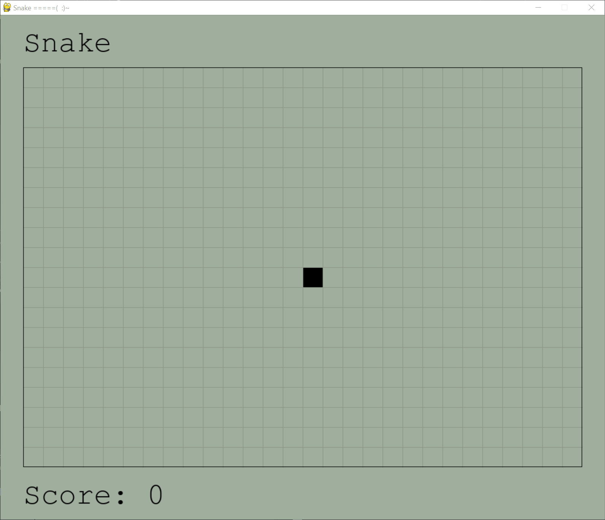

# Snake
 > Author: [Kimberly Yang](https://github.com/kimberlytyang)

## Description
* This is a remake of the original Snake game. It is my first project in Python.
* Language / Tools:
    * [Python](https://www.python.org/) - a programming language that lets you work quickly and integrate systems more effectively
    * [Pygame](https://www.pygame.org/wiki/about) - a set of Python modules that allow you to create fully featured games and programs

## Instructions
* Use the arrow keys to control the snake.
* Don't run into yourself or the walls! The game will end!

## Gameplay Demo

## Download
* Open `main.exe` in this repository and click download
* If Windows Defender rejects the file:
    * Create a new folder
    * Open `Windows Defender settings -> Virus & threat protection -> Virus & threat protection settings`
    * Under `Exclusions`, add the folder you created
    * Clone this repository into the folder
* Run the `main.exe` file
